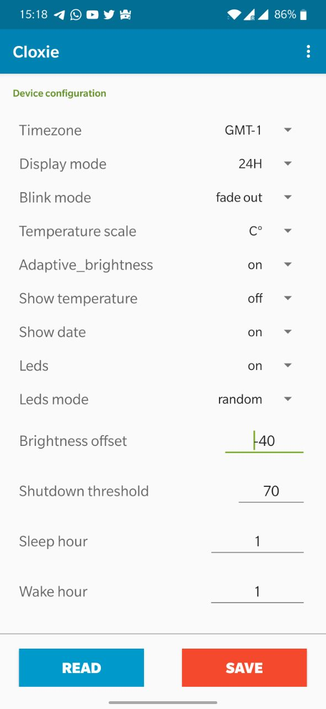
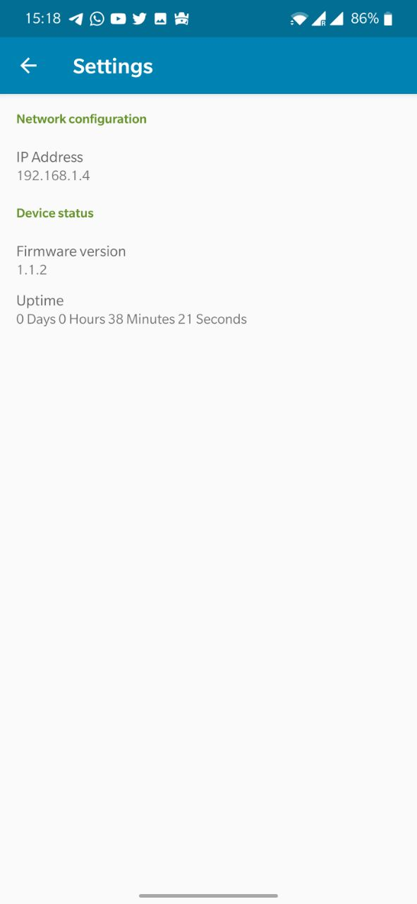

# Cloxie Connect Application

An Android application that connects to a Cloxie Nixie Clock through the local network to set and retrieve the clock configuration. See the related [Cloxie project](https://github.com/vascofazza/cloxie_nixie_clock) for the ESP8266 for software and hardware requirements to run the project. 

# Setup

From the release section download the APK file from the Android Github repository release section and side load onto your mobile device.  If you have a Collie project setup and running, the Android application will be able to automatically connect to the device using the IP address as specified in the settings page of the application.

Once you connect, you can use the "Read" and "Send" buttons below the values to retrieve and set the clock's configuration.  

